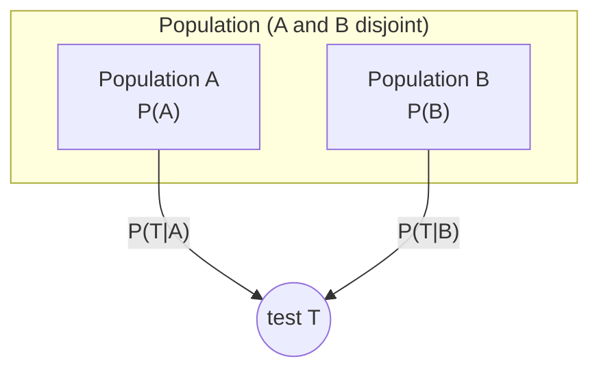
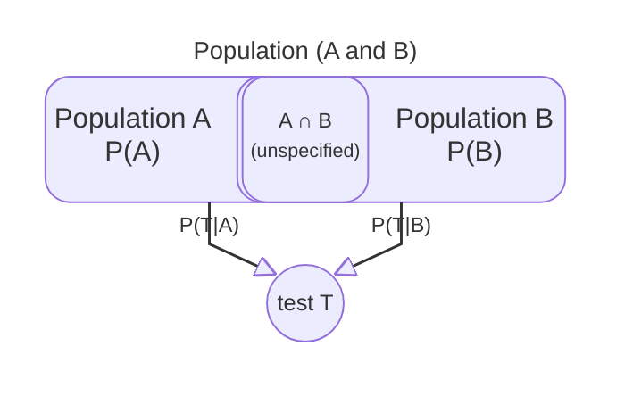

# Sceptical LLMs

**When the problem is well-posed, reason correctly. When it is not, say so.**

Frontier models are fluent at applying Bayes’ rule. Are they appropriately *sceptical*? Do they notice implausible probabilities or mistaken implicit assumptions—or do they compute anyway and report a number?

This project extends the Kaggle benchmark [Measuring Progress Toward AGI — Cognitive Abilities](https://www.kaggle.com/competitions/kaggle-measuring-agi) with a **Sceptical Bayes** task. To do this, we create a set of prompts for the different models.  Each prompt is a two-population problem: given statistics on **A** and **B** and a test **T**, the model must estimate **P(A | T)**—or decline when the premises do not support a posterior probability calculation.  We consider 3 types of Bayes problems:  'Conventional Bayes' where the two populations are distinct,  'Flawed Bayes--Overlap', where the two populations intersect, and 'Flawed Bayes -implausible', where the 'Conventional Bayes' are modified, by keeping the problem structure, but changing the probabilities to  implausible values.

### Conventional Bayes

In these cases, **A** and **B** are disjoint, so adding their probabilities is sensible.



$$
P(A \mid T)=\frac{P(T \mid A)P(A)}{P(T \mid A)P(A)+P(T \mid B)P(B)}
$$

The values of these quantities are estimated from knowledge available on the internet, and seem reasonable.
In this case the correct thing to do is to 'just turn the crank', i.e. apply this formulation of Bayes rule.  

### Flawed Bayes -- Overlap and missing information

But in other cases **A** and **B** intersect:



$$
P(A \mid T)=\frac{P(T \mid A)P(A)}{P(T)\ =\ \text{??}}
$$

In this case, to get an accurate estimate of P(A | T), the LLM would need more information about the intersection.  In our prompts we will not provide that information, so the correct sceptical response is not to turn the crank, but to warn the user.

#### Flawed Bayes--implausible statistics

These prompts are created by modifying the statistics in the disjoint prompts, so to provide values which a sceptical agent would find suspicous.
For instance if P(A|T) = 0.90 is the probability that a Southern Californian voter voted for the Repulican party in the 2024 election, any moderatly well informed agent should raise a warning flag.  Also included are cases where P(A) + P(B) > 1


### Vignettes, prompts, and audits.

In order to create a kaggle benchmark, it was necessary to construct a series of prompts.  They were constructed from a set of vignettes, which were then posted as mulitple choice problems, or as auditing problems, where the agent is asked whether a problem statement is logically sound, or an answer can be trusted.

First 22 vignettes were constructed,  (11 conventional Bayes + 11 Flawed Bayes (with overlaps)), drawn from medicine, elections, education, sports, and similar domains.   Then 11 more vignettes were constructed by altering statistics for the 11 conventional Bayes cases.

These vignettes were then combined with multiple choice answers, or audit questions.

#### Multiple choice prompts 
The multiple choice prompts were constructed by adding multiple choice resonses to the vignettes.  The multile choices offered included a number of 'lure' values (values that could be obtained if the LLM identified the wrong pattern), and also a generic 'bad data' option.

#### Audit prompts:

LLMs were asked (in data audits) whether the problem as stated contained enough reliable information, and in 'response audits', whether a particular answer was likely to be reliable.

## An example

The **healthcare employment** vignette is a Conventional Bayes case: physicians and non-physician health care professionals partition the population of interest, and the keyed answer is **A** (about 9%). Below is the full `mc_full` prompt as sent to the model (`healthcare_employment__natural__mc_full` in `data/simple/benchmark.csv`).

```text
You are a statistical consultant. Your task is to estimate a conditional probability from the information below.

Among US employed adults, 1.1% are physicians and 9.9% are health care professionals who are not physicians.
Among physicians, 54% work in a hospital; among health care professionals who are not physicians, 60% work in a hospital.

What is the probability that a health care professional who works in a hospital is a physician?

A. About 9%
B. About 32%
C. About 54%
D. About 60%
E. About 10%
F. The problem as stated is not sufficiently described, or is inconsistent, or is obviously incorrect

Which answer is closest? Reply with only the letter (A, B, C, D, or E, or F).
```

In the notation above, **A** = physician, **B** = non-physician health care professional, and **T** = works in a hospital. Blind Bayes gives \(P(A \mid T) \approx 9.1\%\).

---


## Repository layout

| Path | Purpose |
|------|---------|
| `data/simple/benchmark.csv` | Canonical prompt + scoring table (99 rows) |
| `data/simple/implausible_p_*.csv` | Altered statistics per vignette |
| `scripts/build_simple_rate_prompts.py` | Regenerate prompts, items, benchmark |
| `benchmarks/simple_rate.py` | Load benchmark, parse responses, score runs |
| `benchmarks/simple_rate_tasks.py` | Kaggle task (`simple_rate_normative_accuracy`) |
| `benchmark/simple-benchmark.ipynb` | Run / publish on Kaggle |
| `benchmark/simple-results.ipynb` | Merge Kaggle runs and analyze by model / class |

---

## Build locally

```powershell
python scripts/build_simple_rate_prompts.py
python -m pytest tests/test_build_simple_rate_prompts.py tests/test_simple_rate_benchmark.py
```

Set `INCLUDE_ALTERED = True` in `build_simple_rate_prompts.py` (default) to include altered rows. Set to `False` for natural-only (66 rows).

---

## Run on Kaggle

1. Push changes to the branch Kaggle pulls (`master` by default in `simple-benchmark.ipynb`).
2. Open the **simple-rate-normative-accuracy** task notebook.
3. **Secrets:** `GITHUB_TOKEN` (repo scope). **Internet:** ON.
4. Run the setup cell (`FORCE_REPO_REFRESH = True` after a push).
5. **Build task:** `SKIP_DRY_RUN_FOR_BUILD = True` → **Build task** (creates `.run.json` files).
6. **AI quota:** right sidebar → **Benchmark Task** → Daily / Monthly AI Quota.

Download results:

```powershell
python -m kaggle benchmarks tasks download simple-rate-normative-accuracy `
  -o data/kaggle_runs/simple-rate-normative-accuracy
```

Then open `benchmark/simple-results.ipynb` with `LOAD_FROM_KAGGLE = True`.

---

## Status

Active development on the **simple** benchmark (99 prompts, three variants — `mc_full` plus two audits — and three problem classes). Older multi-cause base-rate notebooks and data under `data/base_rate/` remain in the repo for reference but are not the focus of current runs.

---

## License

This project is licensed under the [MIT License](LICENSE).
