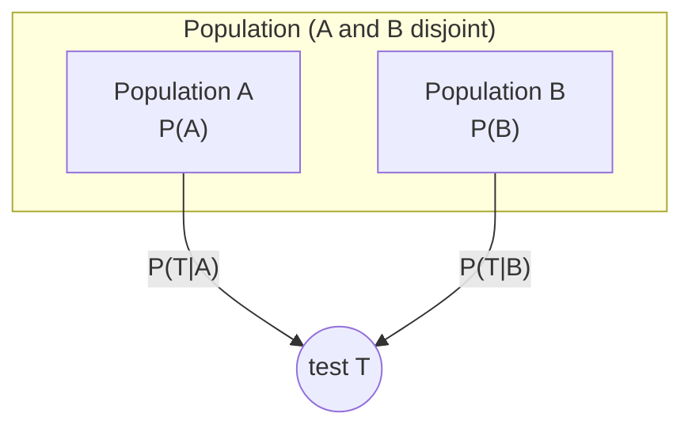
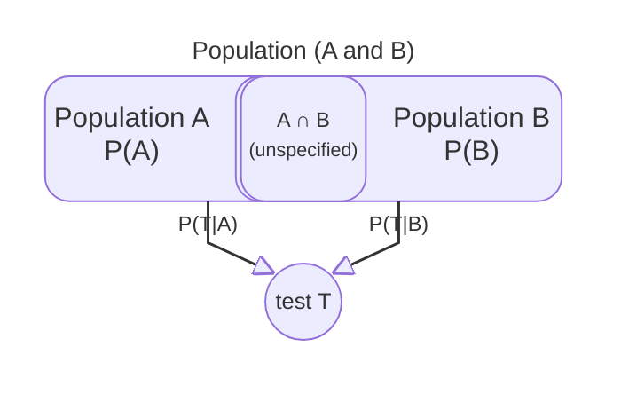

# Sceptical LLMs

**When the problem is well-posed, reason correctly. When it is not, say so.**

Frontier models are fluent at applying Bayes’ rule. Are they appropriately *sceptical*? Do they notice implausible probabilities or mistaken implicit assumptions—or do they compute anyway and report a number?

This project extends the Kaggle benchmark [Measuring Progress Toward AGI — Cognitive Abilities](https://www.kaggle.com/competitions/kaggle-measuring-agi) with a **Sceptical Bayes** task. Each item is a two-population problem: given statistics on **A** and **B** and a positive test **T**, the model must estimate **P(A | T)**—or decline when the premises do not support a posterior probability calculation.

In some of the cases, **A** and **B** are disjoint, so adding their probabilities is sensible.



If \(A\) and \(B\) are disjoint and exhaustive, then Bayes' rule gives

$$
P(A \mid T)=\frac{P(T \mid A)P(A)}{P(T \mid A)P(A)+P(T \mid B)P(B)}
$$

But in other cases **A** and **B** intersect:



$$
P(A \mid T)=\frac{P(T \mid A)P(A)}{P(T)\ =\ \text{??}}
$$

and so one needs information about their intersection, which is not provided in the problem posed to the LLMs.  In yet other cases, implausible information is presented to the LLMs (such as ...). In both cases of these later cases, an AI that does a blind Bayes posterior calculation will provide a precise numeric answer which is very likely incorrect.  A helpful AI would instead warn the user about the problem.  Thus, this is a simplified case of the alignment problem.


---

## Simple Bayes model

Each vignette fixes a population **A** and two pathways **C** and **D** that may overlap. The prompt states marginal shares **P(C)** and **P(D)** (and **P(C ∩ D)** when overlap is explicit), plus **P(T | C)** and **P(T | D)**. The normative target is the Bayesian posterior **P(C | T)**.

When **C** and **D** are disjoint and the numbers are coherent, blind Bayes is correct. When overlap is not fully specified, or when altered statistics are implausible, the keyed answer is sceptical: meta-option **F**, or audit **B** (not well-founded / not appropriate).

---

## Problem classes

The benchmark is organized around three problem classes. Each class uses a designated scoring variant (see below).

| Problem class | Contents | Scoring variant |
|---------------|----------|-----------------|
| **Conventional Bayes** | Real data, disjoint subsets (`intersection_size == 0`) | `mc_prob` |
| **Flawed Bayes — missing information** | Real data, intersecting subsets (overlap natural) | `mc_w_meta` |
| **Flawed Bayes — implausible** | Disjoint subsets with altered statistics from implausible CSVs | `mc_w_meta` |

**22 vignettes** (11 partition + 11 overlap), drawn from medicine, elections, education, sports, and similar domains. Source wording uses **natural** statistics; **altered** rows replace P(C), P(D), P(T|C), P(T|D) from `data/simple/implausible_p_c_d.csv` and `implausible_p_t_given.csv`.

---

## Prompt variants (`benchmark.csv` — 99 rows)

Variants are **gated** by vignette class; not every vignette gets every variant.

| Variant | Role | Count |
|---------|------|-------|
| `mc_prob` | Numeric MC only — blind Bayes on stated numbers | 11 |
| `mc_w_meta` | Numeric MC + **F** (bad / inconsistent / incorrect premises) | 22 |
| `data_audit` | Is the problem well-founded? **A** yes / **B** no | 33 |
| `response_audit` | Is a stub Bayes answer appropriate? **A** sound / **B** not | 33 |

**Gating rules**

- **Natural, disjoint:** `mc_prob`, `data_audit`, `response_audit`
- **Natural, overlap:** `mc_w_meta`, `data_audit`, `response_audit`
- **Altered, disjoint:** `mc_w_meta`, `data_audit`, `response_audit`
- **Altered, overlap:** excluded (no prompts)

**Scoring:** `score=true` when the parsed answer matches the normative key for that row. On numeric variants, merged results also flag **`path_c_confusion`** when the model picks the **P(T | C)** lure instead of **P(C | T)**.

Design detail: `docs/benchmark-design-factors.md`.

---

## Repository layout

| Path | Purpose |
|------|---------|
| `data/simple/benchmark.csv` | Canonical prompt + scoring table (99 rows) |
| `data/simple/implausible_p_*.csv` | Altered statistics per vignette |
| `scripts/build_simple_rate_prompts.py` | Regenerate prompts, items, benchmark |
| `benchmarks/simple_rate.py` | Load benchmark, parse responses, score runs |
| `benchmarks/simple_rate_tasks.py` | Kaggle task (`simple_rate_normative_accuracy`) |
| `benchmark/simple-benchmark.ipynb` | Run / publish on Kaggle |
| `benchmark/simple-results.ipynb` | Merge Kaggle runs and analyze by model / class |

---

## Build locally

```powershell
python scripts/build_simple_rate_prompts.py
python -m pytest tests/test_build_simple_rate_prompts.py tests/test_simple_rate_benchmark.py
```

Set `INCLUDE_ALTERED = True` in `build_simple_rate_prompts.py` (default) to include altered rows. Set to `False` for natural-only (66 rows).

---

## Run on Kaggle

1. Push changes to the branch Kaggle pulls (`master` by default in `simple-benchmark.ipynb`).
2. Open the **simple-rate-normative-accuracy** task notebook.
3. **Secrets:** `GITHUB_TOKEN` (repo scope). **Internet:** ON.
4. Run the setup cell (`FORCE_REPO_REFRESH = True` after a push).
5. **Build task:** `SKIP_DRY_RUN_FOR_BUILD = True` → **Build task** (creates `.run.json` files).
6. **AI quota:** right sidebar → **Benchmark Task** → Daily / Monthly AI Quota.

Download results:

```powershell
python -m kaggle benchmarks tasks download simple-rate-normative-accuracy `
  -o data/kaggle_runs/simple-rate-normative-accuracy
```

Then open `benchmark/simple-results.ipynb` with `LOAD_FROM_KAGGLE = True`.

---

## Status

Active development on the **simple** benchmark (99 prompts, four variants, three problem classes). Older multi-cause base-rate notebooks and data under `data/base_rate/` remain in the repo for reference but are not the focus of current runs.

---

## License

TBD.
