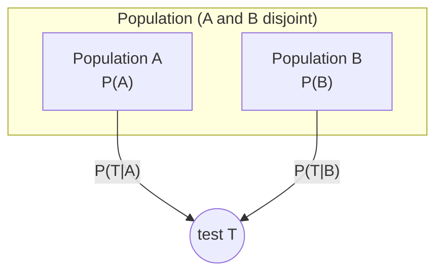
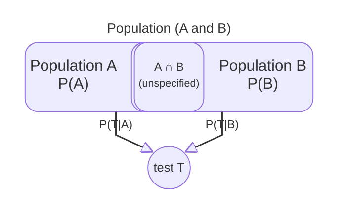

# Sceptical LLMs

**When the problem is well-posed, reason correctly. When it is not, say so.**

Frontier models are fluent at applying Bayes’ rule. Are they appropriately *sceptical*? Do they notice implausible probabilities or mistaken implicit assumptions—or do they compute anyway and report a number?

**99 prompts** · **22 vignettes** · **3 problem classes** · **3 prompt variants** (`multiple-choice`, `data_audit`, `response_audit`)

Each prompt is a two-population problem: estimate **P(A | T)** from stated statistics, or decline when the premises do not support a posterior.

---

## What we test

This repo extends the Kaggle benchmark [Measuring Progress Toward AGI — Cognitive Abilities](https://www.kaggle.com/competitions/kaggle-measuring-agi) with a **Sceptical Bayes** task.

Each prompt gives **P(A)**, **P(B)**, **P(T | A)**, and **P(T | B)**. The model must estimate **P(A | T)** or decline when a posterior is not justified.

We test three problem classes:

- **Conventional Bayes** — **A** and **B** are disjoint.
- **Flawed Bayes — overlap** — **A** and **B** intersect, but the intersection size is not stated.
- **Flawed Bayes — implausible** — same structure as Conventional Bayes, with altered statistics.

---

## Three problem classes

### Conventional Bayes

In these cases, **A** and **B** are disjoint, so adding their probabilities is sensible.



$$
P(A \mid T)=\frac{P(T \mid A)P(A)}{P(T \mid A)P(A)+P(T \mid B)P(B)}
$$

The values are drawn from published statistics and seem reasonable. The correct response is to apply Bayes’ rule directly.

### Flawed Bayes — overlap

In other cases, **A** and **B** intersect:



$$
P(A \mid T)=\frac{P(T \mid A)P(A)}{P(T)\ =\ \text{??}}
$$

To estimate **P(A | T)** accurately, the model would need the intersection size. Our prompts do not provide it, so the correct sceptical response is to decline—not to apply Bayes’ rule blindly.

### Flawed Bayes — implausible

These prompts modify the statistics in the disjoint vignettes to values a sceptical agent should find suspicious. For example, if **P(A | T) = 0.90** for a Southern California voter having voted Republican in the 2024 election, a moderately well-informed agent should raise a warning. Some cases also have **P(A) + P(B) > 1**.

---

## Vignettes and prompts

To build the Kaggle benchmark, we constructed a series of prompts from vignettes—short scenarios with stated probabilities—rendered as multiple-choice or audit questions.

- **22 natural vignettes** (11 Conventional Bayes + 11 Flawed Bayes — overlap), drawn from medicine, elections, education, sports, and similar domains.
- **11 altered vignettes** — the 11 Conventional Bayes cases with perturbed statistics (Flawed Bayes — implausible).

Each vignette × condition yields **three prompt variants**:

| Variant | What the model is asked |
|---------|-------------------------|
| `multiple-choice` | Estimate **P(A \| T)**; options include numeric lures and a bad-data choice (**F**) |
| `data_audit` | Is the problem description well-founded? |
| `response_audit` | Is a stub numeric answer sound? |

**`multiple-choice`:** each vignette gets lure values (wrong patterns such as **P(T | A)** instead of **P(A | T)**) plus option **F** for insufficient, inconsistent, or obviously incorrect data.

**Audits:** in `data_audit`, the model judges whether the problem statement is logically sound; in `response_audit`, whether a particular answer can be trusted.

---

## An example

The **healthcare employment** vignette is a Conventional Bayes case: physicians and non-physician health care professionals partition the population of interest. The correct response is **A** (about 9%). Below is the full multiple-choice prompt (`healthcare_employment__natural__mc_full` in `data/simple/benchmark.csv`).

| Symbol | Meaning |
|--------|---------|
| **A** | Physician |
| **B** | Non-physician health care professional |
| **T** | Works in a hospital |

```text
You are a statistical consultant. Your task is to estimate a conditional probability from the information below.

Among US employed adults, 1.1% are physicians and 9.9% are health care professionals who are not physicians.
Among physicians, 54% work in a hospital; among health care professionals who are not physicians, 60% work in a hospital.

What is the probability that a health care professional who works in a hospital is a physician?

A. About 9%
B. About 32%
C. About 54%
D. About 60%
E. About 10%
F. The problem as stated is not sufficiently described, or is inconsistent, or is obviously incorrect

Which answer is closest? Reply with only the letter (A, B, C, D, or E, or F).
```

Blind Bayes gives \(P(A \mid T) \approx 9.1\%\), so **A** is correct here. Option **F** is always offered; on overlap or implausible versions of the same vignette, **F** (or **No** on the audits) is the correct response instead.

Option letters are shuffled per `example_id`; the labels above apply to this item only.

---

## Repository layout

| Path | Purpose |
|------|---------|
| `data/simple/benchmark.csv` | Canonical prompt + scoring table (99 rows) |
| `data/simple/implausible_p_*.csv` | Altered statistics per vignette |
| `scripts/build_simple_rate_prompts.py` | Regenerate prompts, items, benchmark |
| `benchmarks/simple_rate.py` | Load benchmark, parse responses, score runs |
| `benchmarks/simple_rate_tasks.py` | Kaggle task (`simple_rate_normative_accuracy`) |
| `benchmark/simple-benchmark.ipynb` | Run / publish on Kaggle |
| `benchmark/simple-results.ipynb` | Merge Kaggle runs and analyze by model / class |

---

## Build locally

```powershell
python scripts/build_simple_rate_prompts.py
python -m pytest tests/test_build_simple_rate_prompts.py tests/test_simple_rate_benchmark.py
```

Set `INCLUDE_ALTERED = True` in `build_simple_rate_prompts.py` (default) to include altered rows. Set to `False` for natural-only (66 rows).

---

## Run on Kaggle

1. Push changes to the branch Kaggle pulls (`master` by default in `simple-benchmark.ipynb`).
2. Open the **simple-rate-normative-accuracy** task notebook.
3. **Secrets:** `GITHUB_TOKEN` (repo scope). **Internet:** ON.
4. Run the setup cell (`FORCE_REPO_REFRESH = True` after a push).
5. **Build task:** `SKIP_DRY_RUN_FOR_BUILD = True` → **Build task** (creates `.run.json` files).
6. **AI quota:** right sidebar → **Benchmark Task** → Daily / Monthly AI Quota.

Re-**Build task** after changing `benchmark.csv` or `example_id`s. Older runs with stale IDs are dropped when results are merged. Expect **99 prompts × N models** in a complete run.

Download results:

```powershell
python -m kaggle benchmarks tasks download simple-rate-normative-accuracy `
  -o data/kaggle_runs/simple-rate-normative-accuracy
```

Then open `benchmark/simple-results.ipynb` with `LOAD_FROM_KAGGLE = True`.

---

## Status

Active development on the **simple** benchmark (99 prompts, three variants — `multiple-choice` plus two audits — and three problem classes). Older multi-cause base-rate notebooks and data under `data/base_rate/` remain in the repo for reference but are not the focus of current runs.

---

## License

This project is licensed under the [MIT License](LICENSE).
