# Benchmark design factors

How the **design and evaluation variables** relate in the sceptical-llms base-rate benchmarks.

**Viewing diagrams:** Cursor/VS Code built-in preview (`Ctrl+Shift+V`) does **not** render Mermaid. Use the **SVG figures** below (they show in preview and print), open this file on **GitHub**, or install the [Markdown Preview Mermaid Support](https://marketplace.visualstudio.com/items?itemName=bierner.markdown-mermaid) extension. Diagram sources: `docs/figures/benchmark-design-factors-*.mmd`.

Two layers:

| Layer | Where | What it indexes |
|-------|--------|-----------------|
| **Prompt design** | `data/*/benchmark.csv` | One row per `example_id` (vignette × variant × disclosure fork) |
| **Evaluation results** | merged CSVs, Kaggle `*.run.json` | One row per **`(example_id, model)`** — every design cell crossed with each evaluated LLM |

## Main variables

Six fields stratify almost all analysis.[^derived]

| Variable | Layer | Role |
|----------|-------|------|
| `vignette_name` | design | Which scenario (content domain, probabilities, wording) |
| `condition` | design | **Simple only:** `natural` (source stats) vs `altered` (implausible CSVs) |
| `variant` | design | Response format and option menu |
| `problem_type` | design | Partition vs overlap (base rate) or `well_posed` / `altered` (simple) |
| `well_posed` | design | **Simple scoring flag:** `true` only for natural partition rows |
| `scepticism_required` | design | Whether the keyed correct answer is sceptical/meta rather than blind Bayes |
| `intersection_size` | design | Strength of C∩D overlap (`0` / `small` / `medium` / `large`) |
| `model` | evaluation | Which LLM produced the response (Kaggle model slug) |

**Observational unit (merged results):** `(vignette_name, variant, problem_type, model)` — equivalently `(example_id, model)`, since `example_id` encodes vignette × variant × disclosure fork.

[^derived]: **`response_type`** is derived from `variant` (base rate: `open_probs` → `open`, `mc_numeric_probs` → `mc_numeric`, `mc_full_probs` → `mc_full`; simple: `mc_prob` → `mc_numeric`, `mc_w_meta` → `mc_full`, audits → `data_audit` / `response_audit`). **`has_statistics`** is currently always `true`. Prefer `variant` over `response_type` in groupbys. **Simple benchmark** also has **`condition`** (`natural` | `altered`); see [Simple benchmark](#simple-benchmark-datasimplebenchmarkcsv--176-rows).

---

## Factor definitions

### `vignette_name` (content — comes from the vignette source)

Human-readable scenario label (e.g. `CA Trump voter`, `college STEM work`). Fixed per story; crossed with `variant` (and, in base rate, overlap-disclosure / implausible forks) to form `example_id`.

- **`intersection_size`** is fixed per vignette (see below).
- **`problem_type`** / **`scepticism_required`** are determined by vignette class and disclosure pass (base rate only varies these across forks of the same name).
- Nine vignettes in the base-rate build; **22** in the simple build (11 partition + 11 overlap).

Full list and overlap sizes: `docs/vignette-table.txt`.

### `intersection_size` (structural — comes from the vignette source)

Measures overlap between pathways C and D under universe A:

> Ratio = P(C∩D|A) / max(P(C|A), P(D|A))

| Label | Meaning |
|-------|---------|
| `0` | Partition vignettes (two-cause / well-posed); P(C∩D|A) treated as 0 |
| `small` | Overlap ratio &lt; 10% |
| `medium` | 10%–25% |
| `large` | &gt; 25% |

Set in source CSVs (`docs/base-rate-two-cause-vignettes.csv`, `docs/base-rate-overlap-vignettes.csv`) and propagated into items. **Does not vary within a vignette** — it is a property of the story, not of `variant`.

### `problem_type` (derived from vignette + overlap disclosure)

| Value | When |
|-------|------|
| `well_posed` | Partition vignette (`well_posed=True` on source row) |
| `overlap_explicit` | Overlap vignette; prompt **states** P(C∩D|A) (or equivalent explicit overlap) |
| `overlap_implicit` | Overlap vignette; overlap **not** stated — solver must infer or sceptically decline |
| `implausible` | Partition vignette with statistics replaced from `implausible_statistics.csv` |

Logic (`scripts/build_base_rate_prompts.py` → `_problem_type`):

- Implausible fork → `implausible`
- Else if partition → `well_posed`
- Else → `overlap_{explicit|implicit}` from the disclosure pass

**Simple benchmark:** see [Simple benchmark](#simple-benchmark-datasimplebenchmarkcsv--176-rows). `problem_type` is `well_posed` (natural) or `altered` (perturbed stats). Overlap natural rows use `normative=underdetermined` and `well_posed=false` on the scoring row.

### `scepticism_required` (derived — scoring expectation)

| Value | When |
|-------|------|
| `true` | Implausible vignette **or** overlap vignette with **implicit** disclosure |
| `false` | Partition vignette **or** overlap with **explicit** disclosure |

Logic (`scepticism_required()` in `build_base_rate_prompts.py`):

```text
implausible                          → true
overlap + implicit disclosure        → true
overlap + explicit disclosure        → false
well_posed (partition)               → false
```

**Simple benchmark:** `scepticism_required` depends on **`well_posed`** (scoring flag) and **`variant`**. See [Scoring keys](#scoring-keys-simple-benchmark).

```text
well_posed = true  (natural partition only)
  mc_prob, mc_w_meta     → scepticism_required = false  → score Bayes letter
  data_audit, response_audit → scepticism_required = false  → score A (yes / sound)

well_posed = false  (natural overlap, or any altered)
  mc_prob                → scepticism_required = false  → score Bayes letter
  mc_w_meta              → scepticism_required = true   → score F (bad data)
  data_audit             → scepticism_required = true   → score B (not well-founded)
  response_audit         → scepticism_required = true   → score B (not appropriate)
```

When `scepticism_required=true`, the keyed answer is sceptical (meta or audit **B**), not the blind Bayes lure.

### `variant` (response format — crossed with every applicable vignette × disclosure cell)

| Variant | Prompt shape | MC options |
|---------|--------------|------------|
| `open_probs` | Free-text percentage | — |
| `mc_numeric_probs` | Multiple choice, numeric lures only | A–E (count varies: 4 or 5) |
| `mc_full_probs` | Multiple choice, numeric + meta | A–E plus **F, G, H** (insufficient / inconsistent / obviously incorrect) |

**Base-rate benchmark** (`variants_for_vignette`):

```text
scepticism_required = true   →  mc_full_probs only
scepticism_required = false  →  open_probs, mc_numeric_probs, mc_full_probs
```

**Simple benchmark** — four variants on every vignette × condition cell (no open-text variant):

| Variant | Prompt shape | Options | Role |
|---------|--------------|---------|------|
| `mc_prob` | Statistical consultant; estimate P(target\|T) | Numeric lures only (A–E) | Blind Bayes / arithmetic on stated numbers |
| `mc_w_meta` | Same scenario + question | Numeric lures + **F** | Same as `mc_prob`, but model may refuse bad premises |
| `data_audit` | Data analyst: is this problem well-founded? | **A** yes / **B** no | Premise check before predicting |
| `response_audit` | Data auditor: was the AI’s numeric answer OK? | **A** sound / **B** not appropriate | Critique of a stub Bayes answer |

Meta option **F** (only in `mc_w_meta`): *“The problem as stated is not sufficiently described, or is inconsistent, or is obviously incorrect.”*

Audit **A** / **B** wording is fixed in `scripts/build_simple_rate_prompts.py` (`DATA_AUDIT_*`, `RESPONSE_AUDIT_*`).

### `model` (evaluation — crosses every design cell)

Not in `benchmark.csv`; added when prompts are run on Kaggle (or locally) and merged into results.

| Column | Source |
|--------|--------|
| `model` | Kaggle `modelVersion.slug` from each `*.run.json` (e.g. `google/gemini-3-flash-preview`, `openai/gpt-5.5-2026-04-23`) |

Properties:

- **Independent of design factors** — every `example_id` is evaluated once per model in the run grid; `model` does not change the prompt or scoring keys.
- **Full factorial with design** — merged rows are the Cartesian product of design items × models in the task run (e.g. simple: 35 prompts × 1 model → 35 rows in a single-model run).
- **Dedup key** — when loading multiple downloads, `dedupe_base_rate_prompt_records` keeps the **last** record per `(model, example_id)` (`benchmarks/kaggle_runs.py`).
- **Not in notebook cache id** — kbench caches by `(evaluation row index, model)` only; changing prompts without clearing `*.run.json` can reuse stale answers for the same model + row index.

Current simple-benchmark run (example): 6 models × 176 `example_id`s = 1056 merged rows (if all models complete all items).

---

## Dependency diagram

Factors are **not independent**. Arrows read as “determines” or “constrains”.

### Design factors (prompt CSV)



### Evaluation layer (design × model)



Each `example_id` is replicated once per evaluated `model`; outcomes (`llm_response`, `score`, `path_c_confusion`, etc.) vary by model, not by design rules.

Re-render after editing `.mmd` sources (white background + high-contrast arrows for dark IDE preview):

```bash
cd docs/figures
npx @mermaid-js/mermaid-cli -c benchmark-design-mermaid-config.json \
  -i benchmark-design-factors-design.mmd -o benchmark-design-factors-design.svg -b white
npx @mermaid-js/mermaid-cli -c benchmark-design-mermaid-config.json \
  -i benchmark-design-factors-eval.mmd -o benchmark-design-factors-eval.svg -b white
```

---

## Derived / redundant columns

| Column | Relationship |
|--------|----------------|
| `response_type` | Derived from `variant` — see [^derived] |
| `has_statistics` | Currently always `true` — see [^derived] |
| `example_id` | Slug encoding `vignette_name` + `condition` (simple) + `variant` + disclosure/implausible fork (base rate) |
| `well_posed` / `normative` (scoring) | Simple: `well_posed` is the scoring-well-posed flag; `normative` labels `well_posed` / `underdetermined` / `implausible` |
| `scepticism_score_target` | Scoring key that depends on `variant` + `scepticism_required` (percent, letter, `F\|G\|H`, `meta`, etc.) |

---

## Actual combinations in the repo (current CSVs)

## Simple benchmark (`data/simple/benchmark.csv`) — 176 rows

22 vignettes (11 partition + 11 overlap) × **4 variants** × up to **2 conditions**.

### Conditions

| `condition` | Statistics | Rows |
|-------------|------------|------|
| `natural` | Source vignette probabilities | 22 × 4 = **88** |
| `altered` | Both `data/simple/implausible_p_c_d.csv` (P(C), P(D)) and `data/simple/implausible_p_t_given.csv` (P(T\|C), P(T\|D)) applied | 22 × 4 = **88** |

`example_id` pattern: `{vignette_slug}__{condition}__{variant}` (e.g. `discharged_weapon_last_year__natural__mc_prob`).

**Every vignette** must appear in **both** implausible CSVs; `build_condition_vignettes()` raises if any name is missing.

### Well-posed (scoring flag)

**Well-posed** = `condition=natural` **and** `intersection_size=0` (partition vignettes only — 11 vignettes).

| Class | `well_posed` (CSV) | `normative` (CSV) | Count (× 4 variants) |
|-------|-------------------|-------------------|----------------------|
| Natural partition | `true` | `well_posed` | 44 |
| Natural overlap | `false` | `underdetermined` | 44 |
| Altered | `false` | `implausible` | 88 |

Overlap natural prompts **state** P(C∩D) explicitly (“An estimated X% fall into both categories”). Altered prompts use the same narrative templates with perturbed marginals (COVID / military use absolute-share wording where needed).

### Scoring keys (simple benchmark)

Keyed correct answer by **`well_posed`** × **`variant`**:

| Variant | Well-posed (natural partition) | Not well-posed (overlap natural or altered) |
|---------|-------------------------------|---------------------------------------------|
| `mc_prob` | Bayes lure letter (normative P(target\|T)) | Bayes lure letter (same rule) |
| `mc_w_meta` | Bayes lure letter | **F** (bad-data meta) |
| `data_audit` | **A** (yes — well-founded) | **B** (no — not well-founded) |
| `response_audit` | **A** (yes — sound answer) | **B** (no — not appropriate) |

**`mc_prob` on not-well-posed items:** the keyed answer is still the Bayes letter computed from the stated numbers. Conceptually the “right” response might be *none of the above*, but **`mc_prob` does not offer that option** — scepticism is tested only in `mc_w_meta` and the two audit variants. That split is intentional:

| Variant | What it measures on not-well-posed |
|---------|-----------------------------------|
| `mc_prob` | Can the model compute Bayes from broken or incomplete stats? |
| `mc_w_meta` | Does it notice the problem is broken? |
| `data_audit` | Does it flag bad premises before predicting? |
| `response_audit` | Does it reject a confident numeric answer to bad premises? |

Implementation: `is_well_posed_vignette()` and `scepticism_required_for_variant()` in `scripts/build_simple_rate_prompts.py`; scoring via `scepticism_required` + `scepticism_score_target` in `benchmarks/base_rate.py`.

#### Cross-tab: `well_posed` × `variant` (simple)

| | `mc_prob` | `mc_w_meta` | `data_audit` | `response_audit` |
|--|:--:|:--:|:--:|:--:|
| `well_posed=true` | Bayes | Bayes | A | A |
| `well_posed=false` | Bayes | F | B | B |

#### Simple vignette statistics (natural condition)

One row per vignette (identical across variants within a condition). Source: `data/simple/items.csv`. Full scenario language: `docs/simple-benchmark-scenario-study-sheet.txt`.

**Two-path model:** pathway C = old A∧old C, pathway D = old A∧old D. Marginals `p_c`, `p_d`; `p_c_and_d_given_a` = P(C∩D\|A) for overlap vignettes. Normative P(C\|T) uses overlap-aware Bayes when P(C∩D\|A) > 0. **CA Trump voter** asks P(Southern California \| T) = P(D\|T).

| Vignette | ∩ size | P(C) | P(D) | P(T\|C) | P(T\|D) | P(target\|T) |
|----------|--------|------|------|---------|---------|---------------|
| discharged weapon (last year) | 0 | 29.9% | 13.2% | 0.30% | 0.20% | 77.3% (C) |
| CA Trump voter | 0 | 4.94% | 7.80% | 31% | 27% | 57.9% (D) |
| healthcare employment | 0 | 1.10% | 9.90% | 54% | 60% | 9.09% (C) |
| military overseas (federal pool) | 0 | 14.0% | 20.4% | 58% | 64% | 38.4% (C) |
| covid vaccine (blue/red) | 0 | 19.2% | 7.83% | 8% | 10% | 66.2% (C) |
| … | … | … | … | … | … | … |
| diabetes insulin obese | large | 3.19% | 5.32% | 20% | 16% | 42.8% (C) |
| dog cat household | large | 42.6% | 32.6% | 79% | 53% | 81.2% (C) |

P(target\|T) = `normative_percent`; (C) or (D) marks the question target. Altered rows overwrite P(C), P(D), P(T\|C), P(T\|D) from the implausible CSVs.

### Base-rate benchmark (`data/base_rate/benchmark.csv`) — 44 rows

| problem_type | scepticism_required | intersection_size | variants |
|--------------|---------------------|---------------------|----------|
| `well_posed` | `false` | `0` | open, mc_numeric, mc_full (5 vignettes each → 15 rows) |
| `overlap_explicit` | `false` | small, medium, large | open, mc_numeric, mc_full (4 overlap vignettes → 12 rows) |
| `overlap_explicit` | `true` | small, medium, large | mc_full only (4 rows) |
| `overlap_implicit` | `true` | small, medium, large | mc_full only (8 rows) |
| `implausible` | `true` | `0` | mc_full only (5 rows) |

**Cross-tab: `scepticism_required` × `variant` (base rate)**

| | `open_probs` | `mc_numeric_probs` | `mc_full_probs` |
|--|:--:|:--:|:--:|
| `false` | 9 | 9 | 9 |
| `true` | 0 | 0 | 17 |

When scepticism is required, only the full MC menu (with F/G/H) is offered.

### Merged results (design × model)

| Benchmark | Design rows | Models (example run) | Merged rows |
|-----------|-------------|----------------------|-------------|
| Simple | 176 | varies by download | `176 × n_models` |
| Base rate | 44 | varies by download | `44 × n_models` |

Row count formula: **`n_example_ids × n_models`** (plus empty response rows if a model did not complete an item).

---

## What the main variables do *not* encode

1. **Exact probabilities and prompt text** — fixed by `vignette_name` but not repeated in the six factor names (see `benchmark.csv` / `items.csv`).
2. **Simple vs base-rate benchmark** — simple is a two-path P(C\|T) subset with four variants (`mc_prob`, `mc_w_meta`, `data_audit`, `response_audit`) and natural/altered conditions; base rate keeps open + three MC variants and overlap_implicit / implausible forks.
3. **Overlap disclosure** as its own column — folded into `problem_type` (`overlap_explicit` vs `overlap_implicit`).
4. **Implausible parameter edits** — only distinguished by `problem_type=implausible` + `intersection_size=0`; which statistic was perturbed is in source CSVs.
5. **Lure layout** (which letters map to normative vs P(T|C) confusion, etc.) — scoring metadata (`option_*_lure`), not a top-level factor.
6. **Run metadata** — `reasoning`, token limits, task version, run timestamp (in Kaggle JSON, not always in merged CSV).

---

## Suggested analysis groupings

| Question | Group by |
|----------|----------|
| Which scenario | `vignette_name` |
| Natural vs altered stats | `condition` (simple) |
| MC numeric vs meta vs audits | `variant` |
| Partition vs overlap vs altered | `problem_type`, `intersection_size`, `well_posed` |
| Should model sceptically refuse? | `scepticism_required` or `well_posed=false` |
| Overlap strength | `intersection_size` |
| Model comparison | `model` |
| Model × condition interaction | `model` × `variant` (or × `condition`, etc.) |
| Full design cell | `(vignette_name, condition, variant)` (simple) |
| Single observational unit | `(example_id, model)` |
| Content-only comparison | `vignette_name` holding `condition`, `variant`, and `model` fixed |

---

## Code references

| Logic | File |
|-------|------|
| Factor definitions, variant gating, scepticism rules (base rate) | `scripts/build_base_rate_prompts.py` |
| Simple benchmark: conditions, variants, well-posed, scoring keys | `scripts/build_simple_rate_prompts.py` |
| Sync implausible CSVs to all vignettes | `scripts/sync_simple_implausible_csvs.py` |
| Simple scoring / path-C confusion | `benchmarks/simple_rate.py`, `benchmarks/base_rate.py` |
| Scenario language review sheet | `scripts/build_simple_scenario_study_sheet.py` → `docs/simple-benchmark-scenario-study-sheet.txt` |
| Intersection size thresholds / vignette list | `docs/vignette-table.txt` |
| Model slug from Kaggle runs, merge/dedupe | `benchmarks/kaggle_runs.py` |
| Per-model evaluate grid | `benchmarks/simple_rate_tasks.py`, `benchmarks/base_rate_tasks.py` |
